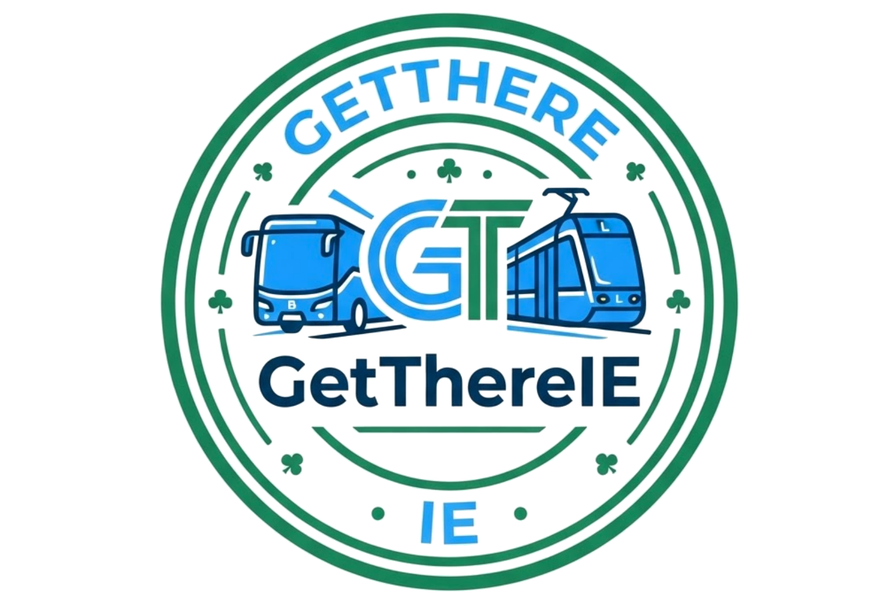

# GetThereIE — Live Dublin Bus & Luas Tracking

<p align="center">
  
</p>

[](https://github.com/calapor/GetThereIE/actions/workflows/ci.yml)
[](https://github.com/calapor/GetThereIE/actions/workflows/ci.yml)

A Next.js app for live Dublin Bus and Luas tracking, built on the NTA GTFS-Realtime feed plus a
local static GTFS schedule. Users search by route or stop, browse nearby stops, see live ETAs
against the timetable, and earn points by reporting bus status.

> ### 📓 [Portfolio documentation →](docs/portfolio/README.md)
> Architecture, data model, GTFS integration, testing strategy, deployment, and a decision log.

## Features

- **Combined route & stop search** — one box searches routes (from a single character) and stops
  (from two characters); results are route-first, with live vehicle counts per route
- **Live arrival board** — real-time ETAs decoded from the NTA GTFS-RT protobuf feed, shown as
  **Scheduled vs Expected** times with a delay status (on time / N min late / early)
- **Headsign & direction** — each trip is labelled with its destination headsign and direction,
  derived from the static schedule
- **Static-schedule fallback** — upcoming trips not yet in the realtime feed are supplemented from
  the timetable so the board is never empty during quiet periods
- **"Live now" per route** — where each vehicle on a route is right now and the next stop it is approaching
- **Nearby stops** — GPS discovery using a bounding-box prefilter plus exact haversine distance
- **Luas board** — Red and Green line forecasts from the RPA Luas Forecasts API
- **Gamified reporting** — thumbs up/down on "Stopped?" and "On time?"; base points per report plus a
  bonus when a vote matches the community majority

## Tech stack

| Area | Choice |
|---|---|
| Framework | Next.js 16 (App Router, standalone output) · React 19 |
| Language | TypeScript |
| App database | Prisma 7 + `@prisma/adapter-better-sqlite3` (SQLite) |
| GTFS timetable | `better-sqlite3` (read-only SQLite, queried directly) |
| Realtime decode | `gtfs-realtime-bindings` (protobuf) |
| Styling | Tailwind CSS 4 |
| Testing | Vitest |
| CI | GitHub Actions (lint · typecheck · test · build · gitleaks) |
| Deploy | Dockerfile → Jenkins → k3s (Helm) |

## Environment variables

| Variable | Required | Default | Purpose |
|---|---|---|---|
| `NTA_API_KEY` | No | *(unset)* | NTA GTFS-RT key. Without it the app hits the public, rate-limited feed. |
| `GTFS_DB_PATH` | No | `./gtfs.db` | Path to the static timetable SQLite file. |
| `DATABASE_PATH` | No | `./dev.db` | Path to the Prisma app SQLite file. |
| `TZ` | Production | *(system)* | Must be `Europe/Dublin` — scheduled arrivals are computed in local time. |
| `APP_VERSION` | No | `dev` | Build stamp shown in the version badge; injected at build time. |

## Getting started

Requires Node 22, pnpm 11.1.1, and a populated `gtfs.db` (see [Static GTFS data](#static-gtfs-data)).

```bash
corepack enable && corepack prepare pnpm@11.1.1 --activate
pnpm install                 # postinstall auto-imports gtfs.db if missing
echo 'NTA_API_KEY=""' > .env.local   # optional — public feed used if unset
pnpm dev
```

Open [http://localhost:3005](http://localhost:3005). See [CONTRIBUTING.md](./CONTRIBUTING.md) for details.

## Static GTFS data

Live ETAs are computed by joining a realtime trip to its scheduled arrival in a local SQLite
database (`gtfs.db`). The NTA realtime feed sends only a delay for most stops, so
**the static schedule must be present and current** — without it no ETA can be produced.

> **Keep the static data fresh.** The NTA rotates trip-ID prefixes periodically. If the
> imported schedule is stale, live trip IDs no longer match and the board silently shows nothing.
> In production the weekly CronJob handles this automatically; locally, reimport when ETAs break.

### Importing

The simplest path downloads every feed and runs the whole pipeline:

```bash
node scripts/refresh-gtfs.mjs   # Dublin Bus + Go-Ahead + Luas, end to end
```

To run the steps manually (order matters):

```bash
curl -sL https://www.transportforireland.ie/transitData/Data/GTFS_Dublin_Bus.zip -o /tmp/GTFS_DB.zip

node scripts/import-gtfs.mjs  /tmp/GTFS_DB.zip   # stop_times (millions of rows)
node scripts/add-stops.mjs    /tmp/GTFS_DB.zip   # stops table with lat/lon
node scripts/add-routes.mjs   /tmp/GTFS_DB.zip   # routes + trips tables
node scripts/add-calendar.mjs /tmp/GTFS_DB.zip   # service calendar + service_id
node scripts/add-operator.mjs /tmp/GTFS_GoAhead.zip   # additional operators
node scripts/add-luas.mjs                        # Luas stops/lines (fetches live)
```

`gtfs.db` is git-ignored — it is never committed.

## Architecture

Two SQLite databases with distinct lifecycles: a Prisma-managed **app DB** (`dev.db`: `User`,
`Report`) and a read-only **GTFS timetable** (`gtfs.db`) queried directly with `better-sqlite3`.
Two realtime sources feed the board — the NTA GTFS-RT protobuf feed (buses) and the RPA Luas
Forecasts API (trams). `getBusesForStop` in `src/lib/nta.ts` joins each live trip-update to its
scheduled arrival, converts scheduled seconds-from-midnight to a Unix timestamp, applies the
realtime delay to produce an ETA, then supplements with static-schedule entries for trips not yet
in the feed. The feed is cached in memory (25s TTL) and on disk so requests within a polling window
reuse one payload.

See the diagram at [`docs/diagrams/architecture.puml`](docs/diagrams/architecture.puml) and the
detailed write-up in [`docs/portfolio/2-system-architecture.md`](docs/portfolio/2-system-architecture.md)
and [`docs/ARCHITECTURE.md`](docs/ARCHITECTURE.md).

## API endpoints

| Endpoint | Query params | Returns |
|---|---|---|
| `GET /api/search` | `q` | Combined route + stop results, with per-route live vehicle counts |
| `GET /api/routes/search` | `q` | Matching routes (id, short/long name) |
| `GET /api/routes/stops` | `routeId`, `q?`, `direction?` | Ordered stops for a route, in route sequence |
| `GET /api/routes/directions` | `routeId` | Distinct directions with the most common headsign |
| `GET /api/routes/live` | `route` | Live vehicles on a route: next stop, `minutesAway`, `delayMinutes`, headsign |
| `GET /api/stops/search` | `q` | Matching stops |
| `GET /api/stops/nearby` | `lat`, `lon` | Nearest stops with `distanceMeters` |
| `GET /api/buses/[stopId]` | — | Live arrivals for one stop (bus feed or Luas forecast, chosen by stop mode) |
| `POST /api/report` | body | Records an `ON_TIME`/`STOPPED` vote and awards points |
| `GET /api/leaderboard` | `userId?` | Ranked leaderboard (currently placeholder data) |
| `POST /api/user` | body | Registers a username (currently in-memory) |
| `GET /api/healthz` | — | Liveness/readiness probe |

## Testing

```bash
pnpm test          # Vitest unit tests — pure functions, no network/DB
pnpm run typecheck # TypeScript type check
pnpm run lint      # ESLint
```

Unit tests cover the pure date/time helpers (`src/lib/time.ts`), the points bonus rule
(`src/lib/points-core.ts`), and the haversine distance function (`src/lib/gtfs-db.ts`). All tests
run without network access or a database. See
[`docs/portfolio/4-testing-strategy.md`](docs/portfolio/4-testing-strategy.md).

## Project structure

```
src/
  app/
    page.tsx                  # home: username gate + search
    nearby/page.tsx           # GPS nearby-stops view
    leaderboard/page.tsx      # leaderboard view
    stop/[stopId]/page.tsx    # single-stop arrival board
    api/
      search/                 # combined route + stop search
      routes/{search,stops,directions,live}/
      stops/{search,nearby}/
      buses/[stopId]/         # live arrivals (bus or Luas)
      report/                 # gamified vote + points
      leaderboard/ user/ healthz/ debug-feed/
  components/                 # SearchFilter, RouteCard, BusRow, LuasBoard, ThumbButtons, ...
  lib/
    nta.ts                    # GTFS-RT decode, caching, ETA join
    luas.ts                   # RPA Luas forecast parsing
    gtfs-db.ts                # better-sqlite3 timetable queries + haversine
    time.ts                   # pure date/time helpers (unit-tested)
    points.ts / points-core.ts# reporting + pure bonus rule (unit-tested)
    db.ts                     # Prisma client (app DB)
  generated/prisma/           # generated Prisma client
prisma/                       # schema + migrations (User, Report)
scripts/                      # GTFS import/refresh pipeline (.mjs)
deploy/helm/bustracker/       # Helm chart (web Deployment, PVC, CronJob, ingress)
deploy/jenkins/               # Jenkins RBAC
docs/                         # ARCHITECTURE.md, portfolio/, diagrams/
```

## Deployment

The app deploys to a home k3s cluster (Raspberry Pi nodes) via Jenkins CI:

```
git push main → Jenkins → buildah image → private registry → helm upgrade (bustracker namespace)
```

The Helm chart lives in `deploy/helm/bustracker`. A `Recreate` strategy enforces SQLite's
single-writer constraint; an init container runs `prisma migrate deploy` on every rollout. After the
**first** deploy, seed the GTFS timetable with the one-off job:

```bash
kubectl -n bustracker create job --from=cronjob/bustracker-gtfs-refresh gtfs-seed
```

The board shows an empty timetable until this completes. After that, a weekly CronJob keeps the data
current automatically. GitHub Actions CI (`.github/workflows/ci.yml`) runs lint, typecheck, tests,
build, and a gitleaks secret scan on every push and PR; Jenkins handles the image push and cluster
deploy on `main` only. See [`docs/portfolio/8-deployment-and-operations.md`](docs/portfolio/8-deployment-and-operations.md).

### Monitoring

The deployed service is monitored by **Uptime Kuma**, which runs in the `platform` namespace on the
same k3s cluster. Uptime Kuma watches the GetThereIE service endpoint and alerts when thresholds are
breached (endpoint down or response time exceeded). The dashboard is at `http://192.168.1.101:30001`.
Monitor configuration is managed through the Uptime Kuma web UI and is not stored in this repo.

## Documentation

- [docs/portfolio/](docs/portfolio/README.md) — full engineering portfolio (9 documents)
- [docs/ARCHITECTURE.md](./docs/ARCHITECTURE.md) — database design, realtime feed, ETA computation
- [docs/diagrams/architecture.puml](./docs/diagrams/architecture.puml) — system diagram (PlantUML)
- [docs/ai-predictions.md](./docs/ai-predictions.md) — planned AI prediction features (not yet implemented)
- [CONTRIBUTING.md](./CONTRIBUTING.md) — dev setup and PR workflow
- [SECURITY.md](./SECURITY.md) — vulnerability reporting and secrets policy

## Roadmap / AI

Planned ML features — "this bus may be late" and "this bus may be full" — are documented in
[docs/ai-predictions.md](./docs/ai-predictions.md). **No model code exists yet;** the board's
Fullness and Historical columns are placeholders wired for that future signal. The document covers
data sources, training signals, and integration points only.

## License

[MIT](./LICENSE) © 2026 Richard O'Connor
